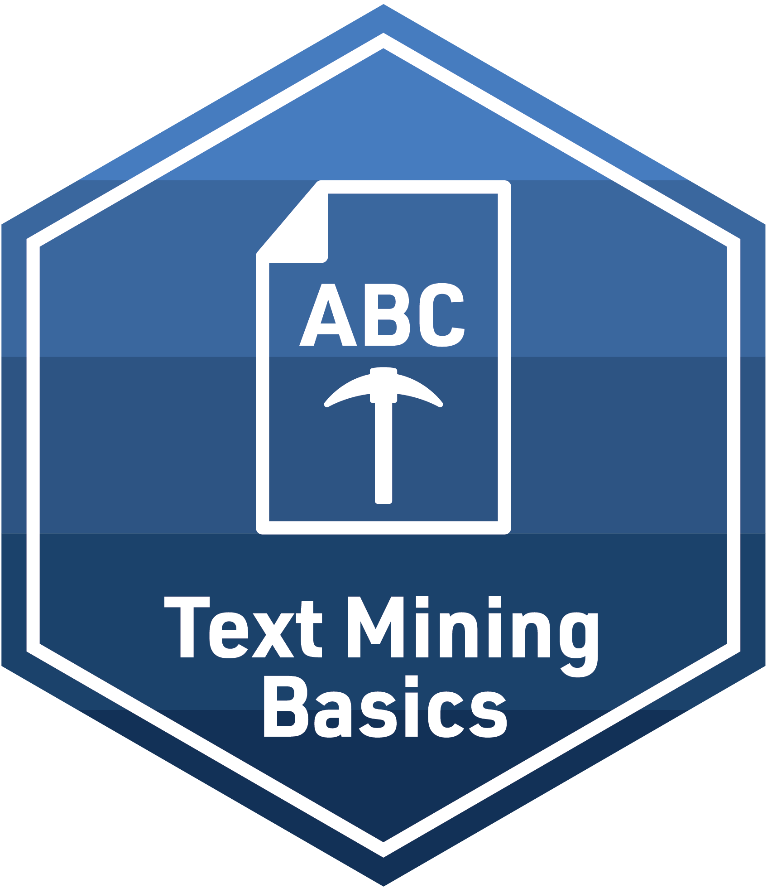

\[Badge Placeholder\]

\[Curricular Overview\] Relationship mining labs address the following critical questions:

1.  

+------------------------------------+-----------------+----------------------------+
| {width="40"} | **Github\       | Repository for Instructors |
|                                    | **              |                            |
+------------------------------------+-----------------+----------------------------+
| {width="40"}  | **Posit Cloud** | Workspace for Learners     |
+------------------------------------+-----------------+----------------------------+

## Module x: \[Title\]

\[Module Overview\]

+-------------------------------------------------+-------------------+----------------------------------------+
| {width="40"} | **Conceptual\     |                                        |
|                                                 | Overview**        |                                        |
+-------------------------------------------------+-------------------+----------------------------------------+
| {width="40"}          | **Code Along**    |                                        |
+-------------------------------------------------+-------------------+----------------------------------------+
| {width="40"}             | **Readings &\     |                                        |
|                                                 | Reflection**      |                                        |
+-------------------------------------------------+-------------------+----------------------------------------+
| {width="40"}          | **Case Study**    | \[Case Study Title\] \| \[Answer Key\] |
+-------------------------------------------------+-------------------+----------------------------------------+
| {width="40"}          | **Badge**         |                                        |
+-------------------------------------------------+-------------------+----------------------------------------+
| {width="47" height="40"}  | **Module Survey** | Feedback Form After Finishing Module   |
+-------------------------------------------------+-------------------+----------------------------------------+

## Microcredential

The culminating activity for the Relationship Mining modules is designed to provide you some space for independent analysis of a self-identified data source. To earn your Relationship Mining Microcredential, you must demonstrate your ability to formulate a relevant research question for relationship mining, effectively manage and analyze data, and clearly communicate your key findings. Your primary goal for this analysis is to create a simple data product that illustrates key findings by applying the knowledge and skills acquired from the essential readings and case studies.

|  |  |  |
|----|----|----|
| {width="40"} | **Microcredential** | Text Mining in Education |

## References
