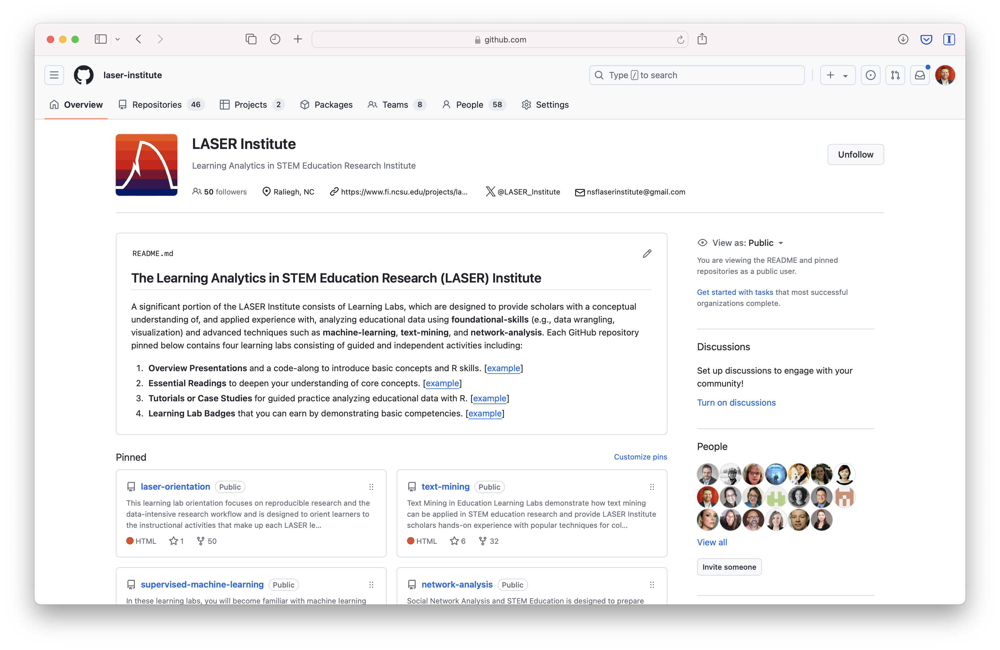
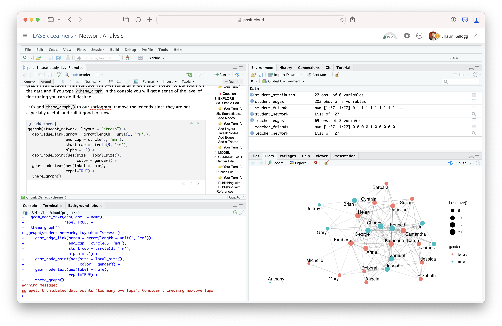
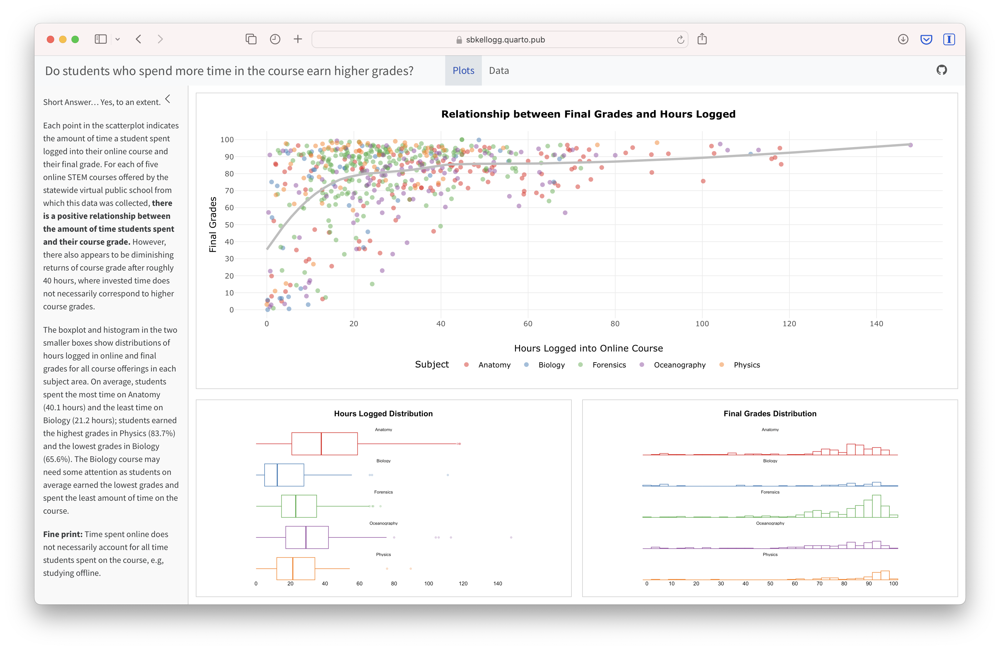
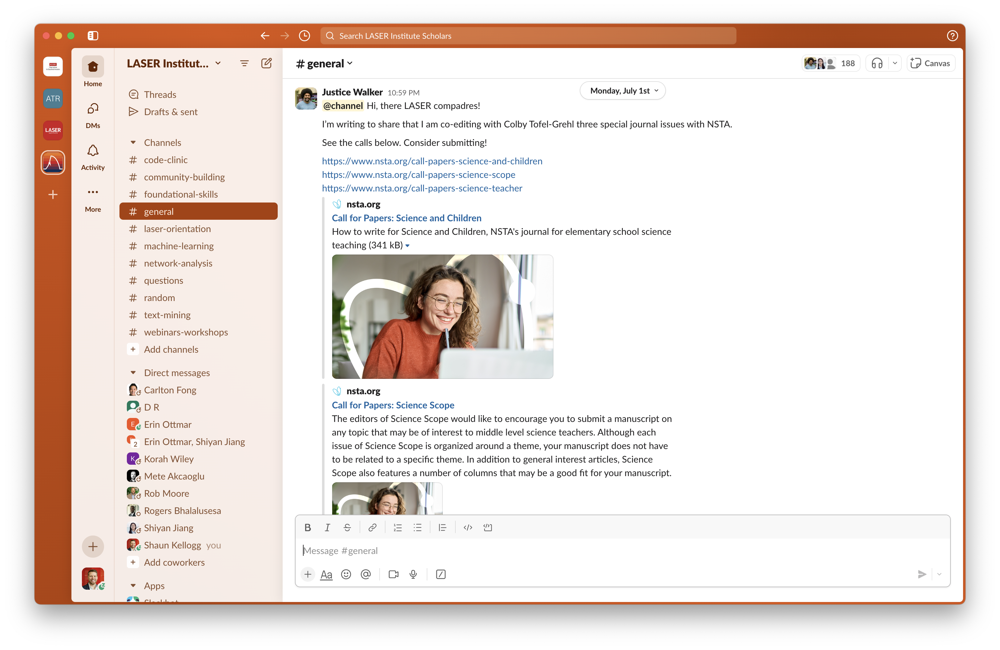

The LASER Institute uses a suite of interactive tools for the design and delivery of instructional activities:

# GitHub

{width="25%"}

[Github](https://github.com) is used for hosting the LASER website and instructional materials. All files and and source code for the is housed on the [LASER Institute GitHub](https://github.com/laser-institute) organization site and deployed using [GitHub Pages](https://pages.github.com), an all-in-one platform deploying dynamic websites from Git. Housing all materials on GitHub allows for version control and collaborative editing of curriculum materials as well as the addition of new materials that may be developed by participants.

**Note**: You can now connect Github CoPilot to your Posit Cloud projects individually. You must have access to [Github CoPilot](#0) through your [Github account](#0). Github’s CoPilot is a AI PairProgrammer that you can enable with RStudio. To read more about the set up check out Posit's [User Guide](#0).

# The R Language & Development Environment

This provides step-by-step instructions for setting up your local environment for data science. LASER's repository supports development in the **RStudio** and **Positron** integrated development environment (IDE).

## Prerequisite: The R Engine

You must install the R language engine **before** installing an IDE. Positron requires R version 4.2.0 or higher.

| Operating System | Architecture |
|:----------------|:----------------|
| [**Windows 10/11**](https://cran.r-project.org/bin/windows/base/) | x64 |
| [**macOS (Apple Silicon)**](https://cran.r-project.org/bin/macosx/big-sur-arm64/base/) | M1, M2, M3, M4 |
| [**macOS (Intel)**](https://cran.r-project.org/bin/macosx/big-sur-x86_64/base/) | Intel Macs |
| [**Linux**](CRAN Linux Binaries) | Distro-specific |

## Choose Your IDE

### Option A: RStudio Desktop (Stable)

Recommended for users focused exclusively on R, RMarkdown, and Shiny applications.

1.  Go to the [RStudio Download Page](https://posit.co/download/rstudio-desktop/).
2.  Select the installer for your OS:
    - [Windows Installer](https://rstudio.org/download/latest/stable/desktop/windows/RStudio-latest.exe)
    - [macOS Disk Image](https://rstudio.org/download/latest/stable/desktop/mac/RStudio-latest.dmg)
3.  Run the installer and follow the default prompts.

### Option B: Positron IDE (Modern/Polyglot)

While RStudio is highly mature, Positron is in active development. You may encounter UI changes, but the core installation logic remains consistent across the 2026 release cycle. Positron is recommended for users who work with both **R and Python** and prefer a VS Code-based workflow.

1.  Navigate to the [Positron Releases Page](https://positron.posit.co/download.html).
2.  Download the version corresponding to your OS.
3.  **Important:** After installation, launch Positron and click the **Interpreter** icon (top right) to select your R version.

### Option C: Other IDE

You are welcome to adapt and complete these activities using a IDE of your preference such as [Jupyter Labs](https://jupyter.org/), [Visual Studio](https://visualstudio.microsoft.com/), [Google Collab](https://colab.research.google.com/), or [PyCharm](https://www.jetbrains.com/pycharm/). Please note that support by the project team for the alternative IDEs is very limited so we will rely on those in our scholar community with expertise to assist.

# LASER Learners Workspace

The LASER Learners Workspace is where we host the interactive R and Python [module activities](https://laser-institute.github.io/laser-website/curriculum-design.html#module-activities). This workspace contains [RStudio “projects”](https://support.posit.co/hc/en-us/articles/200526207-Using-RStudio-Projects) for each method area, each with their own working directory, workspace, installed packages, and source documents.

To access this workspace, use the following link: [go.ncsu.edu/laser-learners](https://go.ncsu.edu/laser-learners).

# LASER Instructors Workspace

The [LASER Instructors Workspace](http://go.ncsu.edu/laser-instructors) is where instructors can customize and adapt the curriculum materials you plan to use for your own webinar, workshop, or course.

# Posit Recipes & Cheat Sheets

For R users, we highly recommend taking advantage of the great resources provided through Posit Cloud for learning R. For example, [Posit Recipes](https://posit.cloud/learn/recipes) provide a collection of R code snippets and instructions featuring up-to-date best practices for coding in R. [Posit Cheat Sheets](https://posit.co/resources/cheatsheets) also provide handy printable reference sheets to commonly used packages and their essential functions, including example code for testing them out.

# Quarto

{width="25%"}

[Quarto](https://quarto.org/) is an open-source scientific and technical publishing system used for creating reproducible, production quality articles, presentations, dashboards, websites, blogs, and books in HTML, PDF, MS Word, ePub, and more. Quarto can be used with R, Python, and other programming languages and is used extensively throughout the institute. All LASER Institute instructional materials, including this website, are created with Quarto.

[Quarto Pub](https://quartopub.com) is a free and easy web publishing platform for Quarto docs. To publish the documents via Quarto Pub, however, you will first need to [create an account](https://quartopub.com/sign-up).

**Note**: If you are using RStudio Desktop, you may need to download and [install Quarto](https://quarto.org/docs/get-started/) first.

Here is an [example data dashboard](https://sbkellogg.quarto.pub/final-grades-and-hours-logged/#plots) built with Quarto for LASER:

# Slack

{width="20%"}

Throughout the year, we provide ongoing asynchronous support and communication through [Slack](https://slack.com/), an app that allows for text messaging, voice and video calls, and media and file sharing either in private chats or as part of communities called "workspaces." Slack runs on all major platforms and devices (e.g., web browser, decktop, iOS, Android, etc.). Create a Slack account to join our [LASER Institute workspace](https://go.ncsu.edu/laser-slack).

